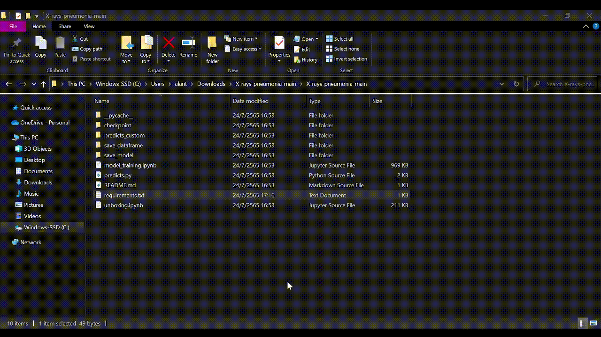

# X-rays images classification
- online app : https://chestxrays.herokuapp.com
- local app : if you want app to your own matchine follow the next step

## Local app
### 1.clone repository 
- click to Code > Download ZIP (then extract the folder)

### 2.install
- python ( if you don't have ) : https://www.python.org/downloads/
- requirements.txt : open CMD in the folder then : python -m pip install -r requirements.txt

### 3.using
- put the images to "predicts_custom" folder
- open CMD in the folder(make sure in folder have predicts.py) : python predicts.py
- the result in "save_dataframe" folder is a .csv file format

## Under the Hood
X-rays image classifications from [Kaggle dataset](https://www.kaggle.com/datasets/paultimothymooney/chest-xray-pneumonia)

model architecture : Convolutional Neural Network (CNN)

for example CNN-architecture

image source : https://www.theclickreader.com/building-a-convolutional-neural-network/

- has 2 conv2D layers and max-pool layers between 
- 1st conv2D 16 filters, 2nd has 32 filters
- with RELU activation.
- finally flatten then 2 output layers for binary classifications.

1st conv2D 16 filters

1st conv2D 16 filters outputs

2nd conv2D 32 filters outputs

some of the filters can detect the Ribs or Space between the Lung.