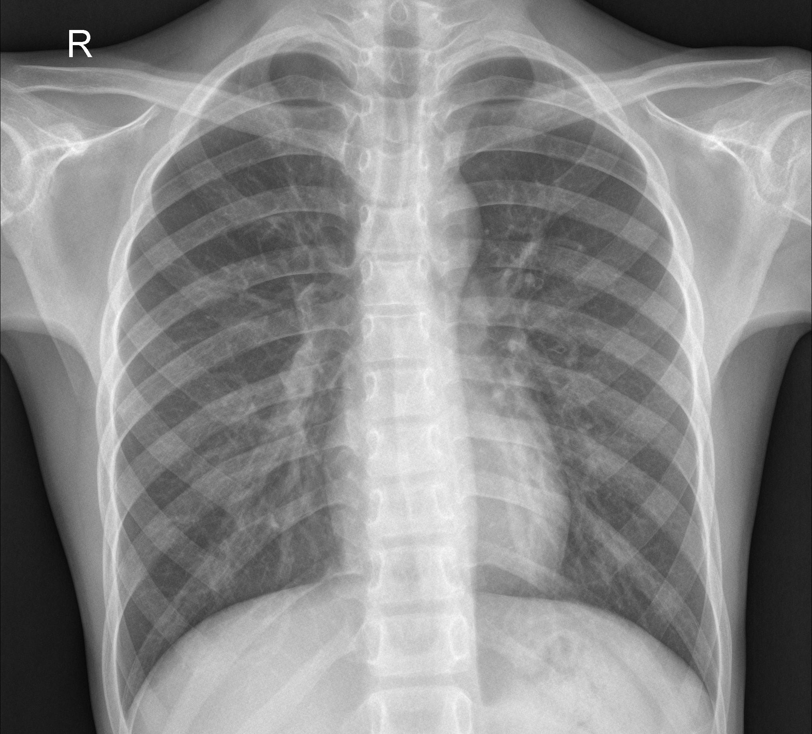

# X-rays images classification
- online app : https://chestxrays.herokuapp.com
- local app : if you want app to your own matchine follow the next step

## Local app
### 1.clone repository 
- click to Code > Download ZIP (then extract the folder)

### 2.install
- python ( if you don't have ) : https://www.python.org/downloads/
- requirements.txt : open CMD in the folder then : python -m pip install -r requirements.txt

### 3.using
- put the images to "predicts_custom" folder
- open CMD in the folder(make sure in folder have predicts.py) : python predicts.py
- the result in "save_dataframe" folder is a .csv file format

## Under the Hood

